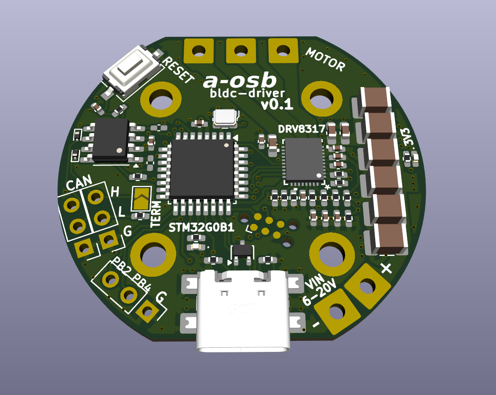
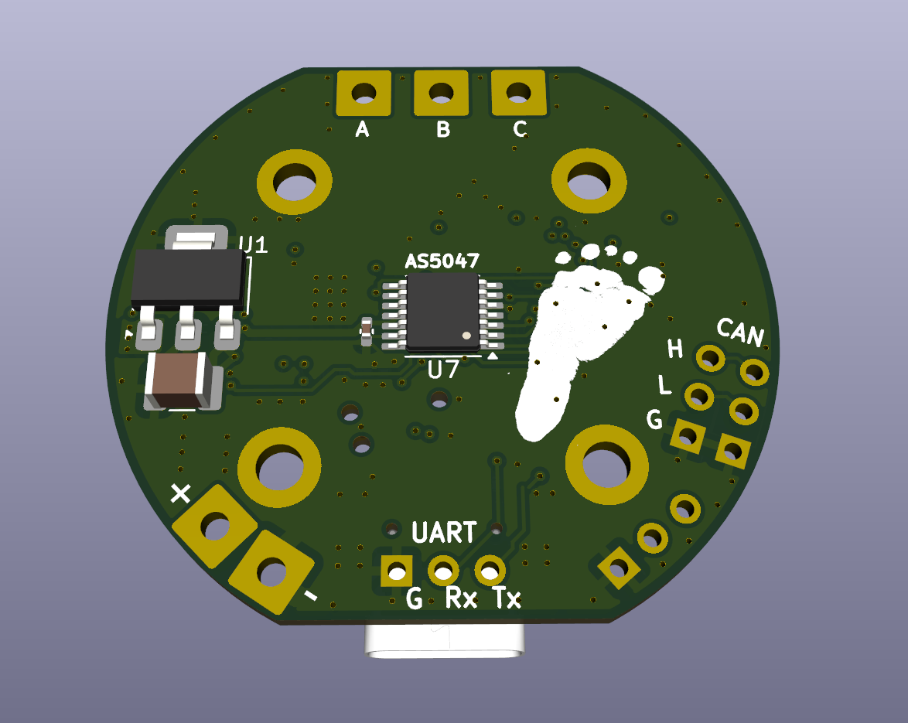

# BLDC Motor Driver
  
This project aims to provide a compact and efficient solution for controlling brushless DC motors in robotics applications. It offers precise feedback and control, making it suitable for tasks that require accurate positioning and smooth motion.

  
Designed to be compatible with the SimpleFOC project

Based on key components
- DRV8317 integrated mosfet BLDC driver
- STM32G0 Microcontroller
- AS5047D magnetic encoder

Interfaces
- UART
- USB
- CAN

